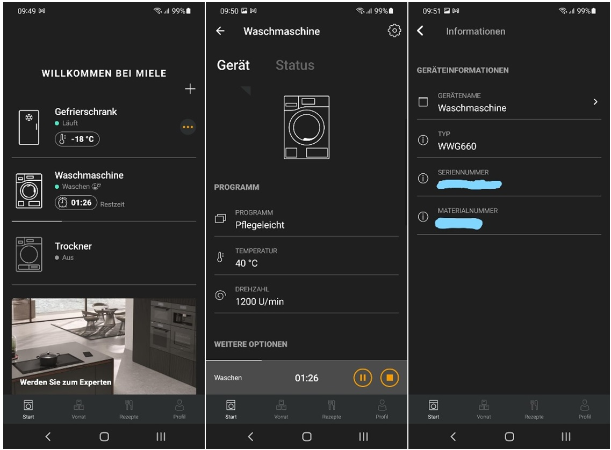
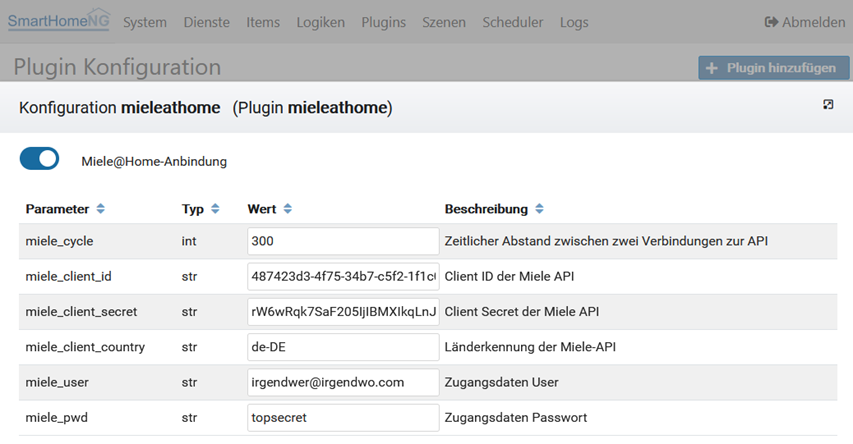
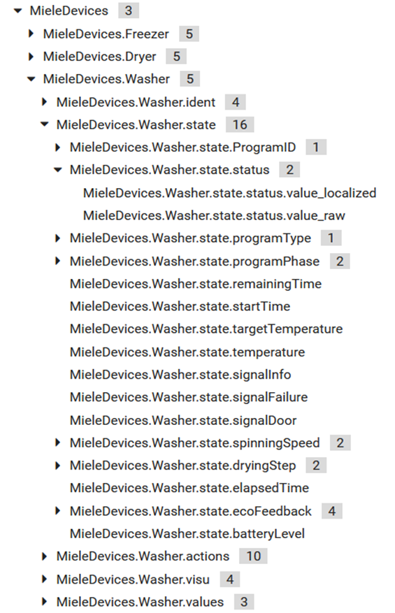
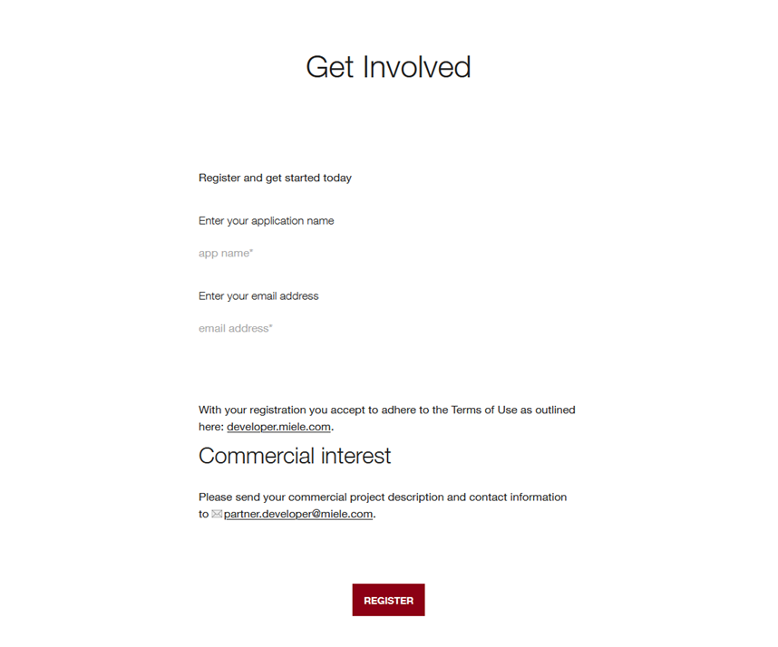
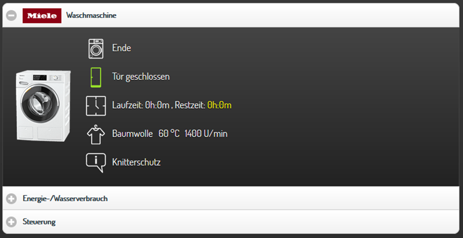
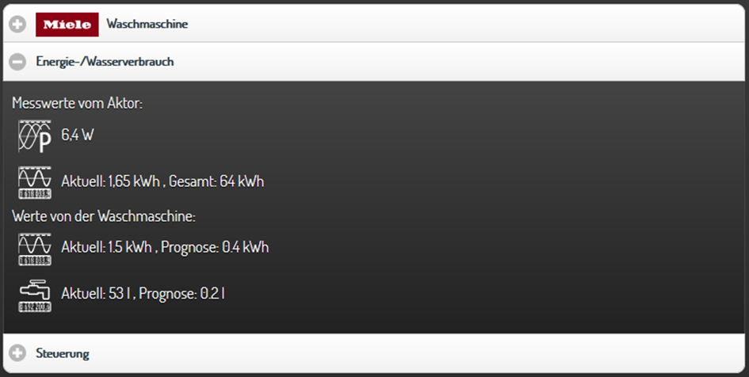
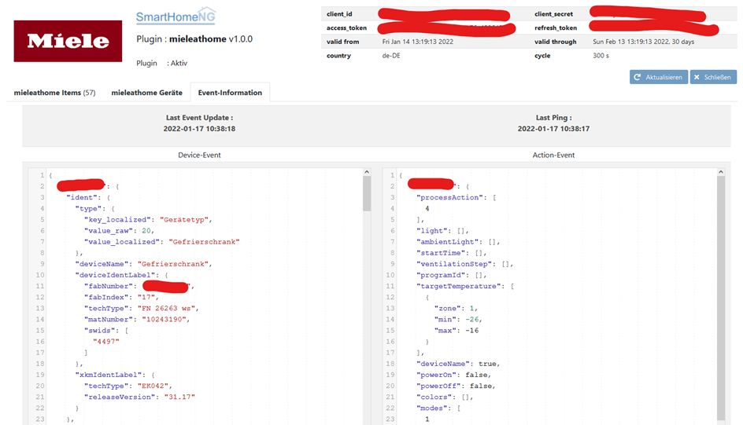

# mieleathome

## Version 1.0.1

Das Plugin ermöglicht den Zugriff auf die Miele@Home API. Es werden Stati abgefragt und
im Rahmen der Möglichkeiten der API können Geräte gesteuert werden.
Es wird das Pollen von Informationen sowie das Event-gestütze Empfangen von Daten unterstützt.
Für das Event-Listening wird ein Stream-request zum Miele-Server aufgebaut. Falls durch den Trennung der
Internet-Verbindung der Stream abreisst wird dies durch das Plugin erkannt und eine neuer Stream
aufgebaut.

## table of content

1. [Change Log](#changelog)
2. [get started - Einführung](#get_started)
3. [Voraussetzungen](#requirements)
4. [Aktivierung des Zugriffs für 3rd party-Apps](#activate)
5. [Einstellungen in der plugin.yaml](#plugin_yaml)
6. [Ermitteln der Device-ID´s](#device_id)
7. [Items definieren](#create_items)
8. [Darstellung in der VISU](#visu)
9. [known issues](#issues)
10. [Web Interface](#webif)

## ChangeLog<a name="changelog"/>

### 2022-01-19
- Version 1.0.1
- erste Version für shNG-Plugins develop-branch

### 2021-11-21
- Version 1.0.0
- first Commit für Tests
- Bedienen und Überwachen von Trocknern und Gefrierschränken ist implementiert
- Folgende Funktionen sind realisiert

    - Status
    - programPhase
    - programType
    - remainingTime
    - targetTemperature
    - temperature
    - signalInfo
    - signalFailure
    - signalDoor
    - dryingStep
    - elapsedTime
    - ecoFeedback
    - batteryLevel
    - processAction ( start / stop / pause / start_superfreezing / stop_superfreezing / start_supercooling / stop_supercooling / PowerOn / PowerOff)

### Todo in Version 1.0.0

- Verarbeitung von "Programmen"
- Verarbeitung von "ambientLight", "light", "ventilationStep", "colors"
- Verarbeiten von "modes"

## Get Started - Einführung<a name="get_started"/>
Dies ist eine Anleitung um das neue SmartHomeNG Plugin für Miele@home-fähige Geräte zu installieren und zu konfigurieren. Möglich sind Statusabfragen und im begrenzten Maße auch die Steuerung, je nach Gerätetyp (z.B. Ein, Aus, Pause, Temperatur, Superfrost,…), soweit vom Gerät und Miele‘s API (Application Programming Interface) unterstützt und in der Praxis sinnvoll.
Das Plugin hat noch Beta-Status, läuft aber inzwischen so gut, dass man es ruhigen Gewissens einsetzen kann. Rückmeldungen zu verwendeten Geräten sind sehr willkommen. Getestet wurden bisher ein Gefrierschrank, ein Trockner und eine Waschmaschine. 

## Voraussetzungen<a name="requirements"/>
1. Die Geräte müssen Miele@home unterstützen, d.h. sie brauchen ein WLAN Modul und müssen nach Anleitung des Herstellers mit dem eigenen WLAN verbunden werden. Neuere Geräte haben ein WLAN Modul meist bereits verbaut, es gibt aber auch welche, für die man sich einen Miele-spezifischen WLAN-Dongle besorgen muss. Mein Gefrierschrank ist z.B. eines dieser Geräte. 
Ältere Geräte, soweit sie WLAN fähig sind und das gleiche Protokoll verwenden, sollten ebenfalls funktionieren. Evtl. ist ein Software-Update nötig. Geräte, die nur per ZigBee kommunizieren, können möglicherweise umgerüstet werden. Dies ist jedoch nicht das Thema dieser Anleitung.

2. Leider lassen sich die Geräte nicht direkt und somit rein lokal einbinden, man ist auf die Miele Cloud angewiesen. Daher braucht man ein Konto bei Miele. Dies kann man z.B. mit Hilfe der Smartphone-/Tablet-App von Miele erledigen. Diese App ist gar nicht mal schlecht. Sie bietet sogar mehr Möglichkeiten als die aktuelle API Version. 

3. Installation der App. Die App findet man hier Android: https://play.google.com/store/apps/details?id=de.miele.infocontrol&hl=de&gl=US iOS: https://apps.apple.com/de/app/miele-app-smart-home/id930406907] Daher: Miele-App installieren, Konto erstellen, Geräte einbinden. Nach Miele Anleitung. Dann geht es weiter mit dem API-Zugriff.

4. Als nächstes muss man sich Zugang zur Miele-API verschaffen. Man braucht hierfür seine in Schritt 2 erzeugten Kontodaten (Username ist eine E-Mail-Adresse). Unter folgendem Link findet man die Miele-API Beschreibung:
https://www.miele.com/developer/
Zusätzlich zu seinen Miele Kontodaten braucht es weitere individuelle Zugriffsdaten, um die API nutzen zu können. Der direkte Link zur Registrierung für die API (Get Involved) ist: https://www.miele.com/f/com/en/register_api.aspx
Für app name kann man sich etwas ausdenken, email address dürfte klar sein. Nach einem Klick auf REGISTER erhält man kurze Zeit später eine Client-ID und ein Client Secret, welche in etwa so aussehen:
 

>Client-ID: 487423d3-4f75-34b7-c5f2-1f1c0971d1e4 
>
>Client-Secret: rW6wRqk7SaF205IjIBMXIkqLnJdIwU5V 

All diese Daten unbedingt merken.

5. Einrichten des Plugins in SmartHomeNG
im Admin-Interface : 
Jetzt kann man das Plugin wie gewohnt in SmartHomeNG laden und konfigurieren. Am besten macht man das über das Admin-Web-Interface. Auf Plugin Hinzufügen klicken, warten, mieleathome in der Liste finden und auswählen. Beispiel:

<code>miele_cycle</code> wird für das Polling der Daten benötigt. 300s sollten völlig ok sein. Weniger als eine Minute würde ich nicht einrichten, auch wenn laut Miele Support selbst 10s momentan kein Problem darstellen. Mir wurde allerdings auch mitgeteilt, dass sich Miele vorbehält, User zu sperren, die zu viele Anfragen in zu kurzer Zeit senden. Es ist aber auch gar nicht nötig, so kurze Polling Intervalle einzustellen, da in der Regel mit Server-Sent-Events (SSE) gearbeitet wird. D.h., der Miele Server sendet neue Status Daten von sich aus. Polling ist somit eigentlich nur beim Neustart wichtig, um die Geräteliste zu bekommen und als „Notnagel“. Sobald das Eventing erfolgreich aktiviert wurde, braucht es das Polling eigentlich nicht mehr. 
Bei miele_user und miele_password bitte die Kontodaten wie in der Miele-App eintragen.
Miele_client_country sollte auf den Ländercode eingestellt werden, der die gewünschte Sprache definiert. Für Deutschland wäre das de-DE. Die Miele-API liefert einige „localized“ Daten dann in der entsprechenden Sprache, siehe folgendes JSON Beispiel:
<pre>
<code>
"state": {
      "ProgramID": {
        "value_raw": 1,
        "value_localized": "Baumwolle",
        "key_localized": "Programmbezeichnung"
      },
      "status": {
        "value_raw": 5,
        "value_localized": "In Betrieb",
        "key_localized": "Status"
      },
      "programType": {
        "value_raw": 1,
        "value_localized": "Eigenes Programm",
        "key_localized": "Programmart"
      },
      "programPhase": {
        "value_raw": 266,
        "value_localized": "Schleudern",
        "key_localized": "Programmphase"
      },
      "remainingTime": [
        0,
        26
      ], 
</code>
</pre>
miele_client_id und miele_client_secret siehe Voraussetzungen Schritt 4.

6. item-Definition  
Der letzte Schritt in SmartHomeNG ist die Definition der Items. Die Hauptarbeit wurde bereits in der plugin.yaml im Verzeichnis des mieleathome Plugins erledigt. Alles was man braucht sind die Seriennummern der Geräte, auch fabNumber genannt. Diese erhält man u.a. über die Informationen zu den Geräten in der Miele-App, wie in Voraussetzungen Schritt 2 gezeigt, oder findet sie auf dem Typenschild. Das folgende Beispiel zeigt die komplette Item-Definition, die ich für meine drei Geräte erzeugen musste. Das ist fast nichts.
<pre>
<code>
# Miele.yaml
%YAML 1.1
---
MieleDevices:
    Freezer:
        type: str
        miele_deviceid: 'xxxxx'
        struct: mieleathome.child
    Dryer:
        type: str
        miele_deviceid: 'yyyyy'
        struct: mieleathome.child
    Washer:
        type: str
        miele_deviceid: 'zzzzz'
        struct: mieleathome.child
</code>
</pre>
miele_deviceid entspricht der Seriennummer (auch fabNumber) des jeweiligen Geräts. Nach einem Neustart von SmartHomeNG ergibt sich im Item-Baum dadurch folgendes Bild, welches nur einen Ausschnitt der vorhandenen Items zeigt. 

## Aktivierung des Zugriffs für 3rd party-Apps<a name="changelog"/>

Eine App unter https://www.miele.com/f/com/en/register_api.aspx registrieren. Nach Erhalt der Freischalt-Mail die Seite aufrufen und das Client-Secret und die Client-ID kopieren und merken (speichern).
Dann einmalig über das Swagger-UI der API (https://www.miele.com/developer/swagger-ui/swagger.html) mittels Client-ID und Client-Secret über den Button "Authorize" (in grün, auf der rechten Seite) Zugriff erteilen. Wenn man Client-Id und Client-Secret eingetragen hat wird man einmalig aufgefordert mittels mail-Adresse, Passwort und Land der App-Zugriff zu erteilen.

Die erhaltenen Daten für Client-ID und Client-Secret in der ./etc/plugin.yaml wie unten beschrieben eintragen.

##Settings für die /etc/plugin.yaml<a name="plugin_yaml"/>

<pre><code>
mieleathome:
    plugin_name: mieleathome
    class_path: plugins.mieleathome
    miele_cycle: 120
    miele_client_id: ''
    miele_client_secret: ''
    miele_client_country: 'de-DE'
    miele_user: ''      # email-Adress
    miele_pwd: ''       # Miele-PWD
</code></pre>

## Ermitteln der benötigten Device-ID´s<a name="device_id"/>

Das Plugin kann ohne item-Definitionen gestartet werden. Sofern gültige Zugangsdaten vorliegen
werden die registrierten Mielegeräte abgerufen. Die jeweiligen Device-Id´s können im WEB-IF auf dem
zweiten Tab eingesehen werden.

## Anlegen der Items<a name="create_items"/>

Es wird eine vorgefertigtes "Struct" für alle Geräte mitgeliefert. Es muss lediglich die Miele-"DeviceID" beim jweiligen Gerät
erfasst werden. Um die Miele-"DeviceID" zu ermitteln kann das Plugin ohne Items eingebunden und gestartet werden. Es werden im Web-IF
des Plugins alle registrierten Geräte mit der jeweiligen DeviceID angezeigt.
Führende Nullen der DeviceID sind zu übernehmen

<pre>
<code>
%YAML 1.1
---
MieleDevices:
    Freezer:
        type: str
        miele_deviceid: 'XXXXXXXXXXX'
        struct: mieleathome.child
    Dryer:
        type: str
        miele_deviceid: 'YYYYYYYYYYY'
        struct: mieleathome.child

</code>
</pre>

## Darstellung in der VISU<a name="visu"/>

Es gibt eine vorgefertigte miele.html im Plugin-Ordner. Hier kann man die jeweiligen Optionen herauslesen und nach
den eigenen Anforderungen anpassen und in den eigenen Seiten verwenden.

Hier zuerst mal ein paar Beispielbilder, wie das aussehen kann, aber natürlich nicht muss.

Abgesehen von „Messwerte vom Aktor“ werden alle anderen Informationen und Steuerungsmöglichkeiten vom Plugin bereitgestellt. Besonders die Möglichkeiten der Steuerung hängen davon ab, was Miele über die API zur Verfügung stellt. Leider ist das im Vergleich zur Miele-App etwas weniger. In der Visu werden bei entsprechender Verwendung der Widgets immer nur die Optionen dargestellt, die im aktuellen Betriebsmodus auch erlaubt sind. In der Praxis hat sich bei mir gezeigt, dass das vollkommen ausreicht. Eine Besonderheit ist hier der Gefrierschrank. Man kann die Soll-Temperatur über das Pull-down Menü auswählen und den Superfrost Modus per Klick auf die Schneeflocke.
Alles andere ist reine Optik, so zum Beispiel die Bilder, das Miele Logo, das Layout, etc.
Das Miele Logo kann man sich bei Miele selbst besorgen. Man kann es in sehr guter Qualität hier direkt downloaden: https://www.miele.com/developer/assets/logo_package.zip
Die Geräte Bilder muss man sich selber suchen und evtl. etwas aufbereiten (z.B. kein Hintergrund). 
Ich habe die Bilder und das Logo in den <code> /dropins/ Ordner </code> der smartVISU kopiert, z.B.
<code> dropins/icons/ws/  </code>für das Logo
<code> dropins/icons/ </code>für Gerätebilder
In der Beispiel HTML Datei Visu Examples.html findet man die Referenzen auf diese Bilder und Icons.
Eine weitere Quelle für die smartVISU Integration ist die beim Plugin mitgelieferte Datei miele.html. Hier habe ich mir auch die Elemente rausgesucht.

## known issues<a name="issues"/>
### Trockner :
Ein Trockner kann nur im Modus "SmartStart" gestartet werden.
Es muss der SmartGrid-Modus aktiv sein und das Gerät auf "SmartStart" eingestellt werden.
Der Trockner kann dann via API/Plugin gestartet werden bzw. es kann eine Startzeit via API/Plugin gesetzt werden

## Das Web-Interface<a name="webif"/>

Das Plugin bietet auch ein einfaches Webinterface, welches nützliche Informationen liefert. Es ist noch nicht ganz fertig. Im Items Tab fehlen noch einige Items pro Gerät. Nichtsdestotrotz ist es für die Fehlersuche und einen schnellen Überblick sehr nützlich. Oben rechts findet man einen Block mit den grundlegenden Daten zur Kommunikation mit dem Miele Server. Nach erfolgreicher Authentifizierung (OAuth2) mit Hilfe der Kontodaten (E-Mail und Passwort), der client_id und dem client_secret, erhält man ein access_token, mit dem die eigentliche Kommunikation mit dem Server gesichert wird. Dieses Token hat eine begrenzte Gültigkeit, daher werden sowohl das Erstellungsdatum als auch das Ablaufdatum angezeigt. Aktuell ist die Gültigkeit jeweils 30 Tage. Kurz vor Ablauf holt sich das Plugin ein neues access_token und zwar mit Hilfe des refresh_token, welches während der Laufzeit des Plugins unverändert bleibt.
Die Spracheinstellung für einige Klartext Parameter der vom Miele Server gesendeten Daten und der Polling-Zyklus wird ebenfalls angezeigt.
Unterhalb dieser Daten gibt es natürlich die bekannten Buttons für Aktualisieren und Schließen.

Darunter findet man drei Tabs, mieleathome Items, mieleathome Geräte und Event-Information.
Wie bereits erwähnt, werden im Items Tab noch nicht alle zu erwartenden Items angezeigt. Die Anzeige sollte hier aber selbsterklärend sein.
Auch der Geräte Tab ist einfach zu verstehen. Hier werden die Seriennummern der Geräte, das dazugehörige linked Item, der Gerätetyp und das Gerätemodell aufgelistet. Linked Item ist hierbei der Name des Basis-Items, welches man in seiner yaml Datei vergeben hat, siehe vorherige Seite. Wer tatsächlich mehrere Geräte gleichen Typs einbinden will muss dort natürlich eindeutige Namen vergeben. Die Seriennummern reichen NICHT, da sie nicht Bestandteil des Item-Pfads sind.

Last but not least der Event-Informationen Tab. Wie bereits kurz angerissen, schickt Miele Server-Sent-Events (SSE) nach einer erfolgreichen „Subscription“ durch das Plugin. Ändert sich etwas am Zustand eines Geräts, wird der Einfachheit halber der zustand ALLER Geräte in einem JSON String gesendet. Gibt es momentan keine Änderung, erhält man alle 5s ein Ping. 
Unterschieden wird dabei in Device-Events und Action-Events. 
Device-Events enthalten den kompletten Status aller registrierten Geräte.
Action-Events enthalten die möglichen Aktionen, welche pro Gerät im aktuellen Betriebszustand möglich sind. So kann ein AUSgeschaltetes Gerät natürlich nur EINgeschaltet werden, ein laufendes Gerät aber möglicherweise nicht nur ausgeschaltet, sondern auch pausiert werden. Mit dieser Information kann man in einer Visu immer nur die Steuerungsmöglichkeiten einblenden, die gerade zur Verfügung stehen. Siehe Abschnitt zu den Visu Beispielen.

Tipp: Wegen des 5s Ping Intervalls werden die beiden Felder momentan in diesem Rhythmus aktualisiert. Scrollt man also innerhalb der Listen nach unten, springt die Anzeige nach spätestens 5s wieder an den Anfang. Möglicherweise lässt sich dieses Verhalten noch ändern. Als Workaround einfach mit strg-a und strg-c in die Zwischenablage kopieren und in einem Editor betrachten. Kann man im Editor als Format JSON einstellen, sieht es gleich viel besser aus.

